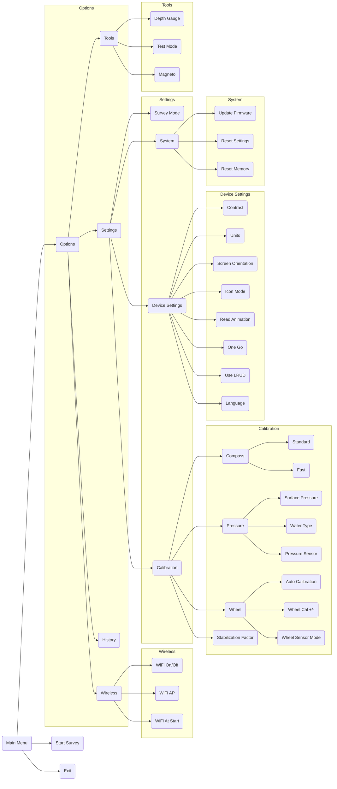

# Menus Overview

This document provides a visual representation of the MNemo menu structure.

## Main Menu Structure

```mermaid
graph LR
    Main(Main Menu)
    Start(Start Survey)
    Options(Options)
    Exit(Exit)

    Main --> Start
    Main --> Options
    Main --> Exit

    %% Options Submenu
    subgraph OptionsMenu [Options]
        direction TB
        WiFi(Wireless)
        Settings(Settings)
        History(History)
        Tools(Tools)

        Options --> WiFi
        Options --> Settings
        Options --> History
        Options --> Tools
    end

    %% Wireless Submenu
    subgraph WiFiMenu [Wireless]
        direction TB
        WOn(WiFi On/Off)
        WAP(WiFi AP)
        WStart(WiFi At Start)

        WiFi --> WOn
        WiFi --> WAP
        WiFi --> WStart
    end

    %% Settings Submenu
    subgraph SettingsMenu [Settings]
        direction TB
        SurveyMode(Survey Mode)
        Calibration(Calibration)
        DevSet(Device Settings)
        System(System)

        Settings --> SurveyMode
        Settings --> Calibration
        Settings --> DevSet
        Settings --> System
    end

    %% Calibration Submenu
    subgraph CalibrationMenu [Calibration]
        direction TB
        CalCompass(Compass)
        CalPressure(Pressure)
        CalWheel(Wheel)
        StabFactor(Stabilization Factor)

        Calibration --> CalCompass
        Calibration --> CalPressure
        Calibration --> CalWheel
        Calibration --> StabFactor

        CalCompass --> CalCompStd(Standard)
        CalCompass --> CalCompFast(Fast)

        CalPressure --> CalSurface(Surface Pressure)
        CalPressure --> WaterType(Water Type)
        CalPressure --> PressureSensor(Pressure Sensor)

        CalWheel --> AutoCal(Auto Calibration)
        CalWheel --> WheelCalPM(Wheel Cal +/-)
        CalWheel --> WheelSensor(Wheel Sensor Mode)
    end

    %% Device Settings Submenu
    subgraph DeviceSettingsMenu [Device Settings]
        direction TB
        Contrast(Contrast)
        Units(Units)
        Orientation(Screen Orientation)
        IconMode(Icon Mode)
        ReadAnim(Read Animation)
        OneGo(One Go)
        LRUD(Use LRUD)
        Language(Language)

        DevSet --> Contrast
        DevSet --> Units
        DevSet --> Orientation
        DevSet --> IconMode
        DevSet --> ReadAnim
        DevSet --> OneGo
        DevSet --> LRUD
        DevSet --> Language
    end

    %% System Submenu
    subgraph SystemMenu [System]
        direction TB
        Update(Update Firmware)
        ResetSet(Reset Settings)
        ResetMem(Reset Memory)

        System --> Update
        System --> ResetSet
        System --> ResetMem
    end

    %% Tools Submenu
    subgraph ToolsMenu [Tools]
        direction TB
        DepthGauge(Depth Gauge)
        TestMode(Test Mode)
        Magneto(Magneto)

        Tools --> DepthGauge
        Tools --> TestMode
        Tools --> Magneto
    end
```
