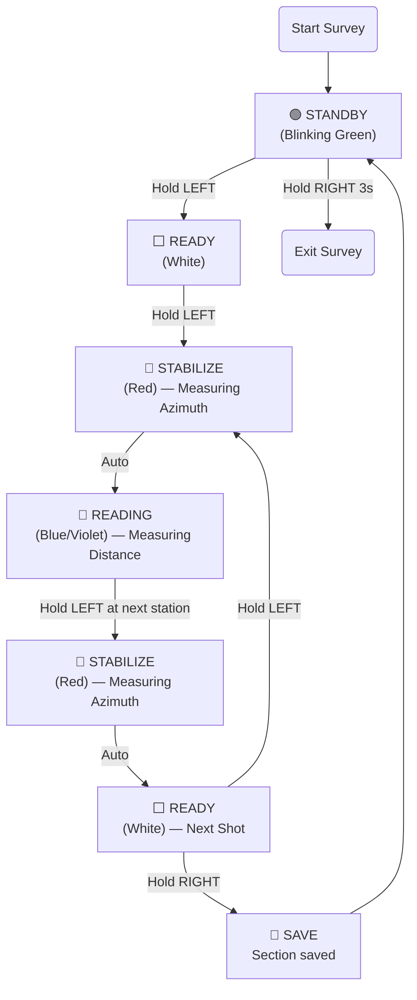
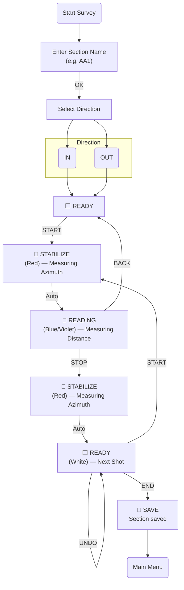

# Survey Flow

## BASIC Mode

## Verbose Mode

## Color Reference

| Color | Phase | Description |
|-------|-------|-------------|
| 🟢 Green (blinking) | Standby | Waiting to start a section |
| ⬜ White | Ready | Ready to begin a shot |
| 🔴 Red | Stabilize | Compass is measuring the azimuth — keep the device still |
| 🔵 Blue / Violet | Reading | Wheel is measuring the distance — move along the line |
